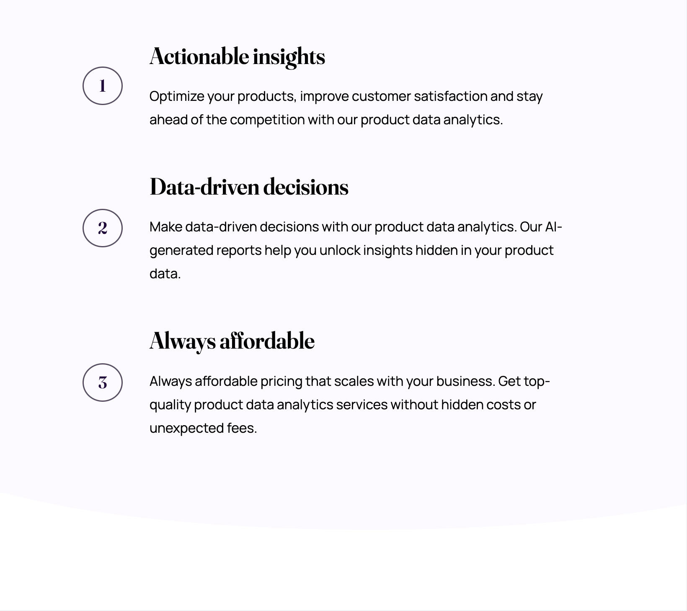
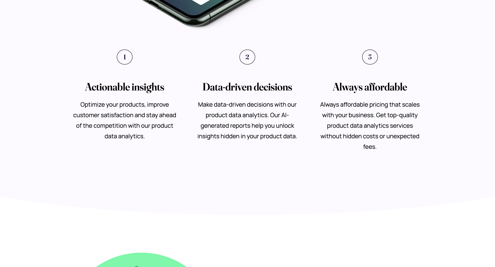

# Workit landing page

This repository contains an implementation of one of the Frontend Mentor Challenges - [Workit landing page](https://www.frontendmentor.io/challenges/workit-landing-page-2fYnyle5lu) using HTML/CSS.

## Overview

### The Challenge

This challenge ([Workit landing page](https://www.frontendmentor.io/challenges/workit-landing-page-2fYnyle5lu)) was the eight one I picked from the [Frontend Mentor](https://www.frontendmentor.io).

Althought I had still chosen it amongst "the easiest" ones, and implemented it in vanilla CSS, it was definitely quite a challenging project.

But as usual, I wasn't aiming to have the pixel-perfect result, but rather making sure the chosen techniques are done well. 

Let me break things up in the next few paragraphs.

### Screenshots

There are a few screenshots captured within the various screen sizes.

#### Mobile Version

This is the **mobile version** as displayed on **iPhone 12 Pro**.

#### Tablet Version

This is the **tablet version** as displayed on **iPad Air**.

#### Desktop Version

This is the **desktop version** as displayed on a large screen.

### Links

- Solution URL: [https://github.com/radektomasek/fm-workit-landing-page](https://github.com/radektomasek/fm-workit-landing-page)
- Live Site URL: [https://radektomasek.github.io/workit-landing-page](https://radektomasek.github.io/workit-landing-page)

## My process

Building [this challenge](https://www.frontendmentor.io/challenges/workit-landing-page-2fYnyle5lu) was a really nice experience. However, it took me a bit longer than I was initially planned. And I had been travelling a bit, needed to finish it on the go. But I rather did that than rushing with incomplete solution.

**Here are a few hightlights from my implementation**

- I used CSS variables intensively. 
- There was a bit of transformation and absolute positioning. 
- I used pseudoelements `::before` and `::after` for the specific transformed object.

As usual, I had chosen the vanilla CSS with an intensive amount of CSS variables. However, I think project of this size would benefit significantly with the usage of preprocessor to reduce to number of repetition. On the other hand, it truly helps with understanding of specific CSS features.

Most of the stuff was relatively straighforward. As I have the access to Figma, it's not problem to define most of the values in advance. An extra thing was to add imports of fonts locally (as specific fonts were attached as assets).

The biggest complication was adding some specific decorative styles - rounded elipses in particular. I had been familiar with the patterns behind, it just took me a bit longer to position things in a way that correspond with the design patterns.

The result is probably slightly off, but it's not a big issue as I usually focus on applying correct techniques rather than anything else. And I am personally happy with the result. But there are definitely things to improve, that's for sure.

### Built with

- Semantic HTML5 markup
- Mobile-first workflow
- CSS Flexbox
- CSS Custom Properties (variables)
- [Parcel](https://parceljs.org) - a simple, zero config builder

### What I learned

Quite a neat trick was applying of the generated [SVG Filter](https://angel-rs.github.io/css-color-filter-generator). I had always used similar values previously, tweaked a bit sometimes. But the usage of a generated value based on a simple input made things very easy for creating the hover effect. 

### Continued development

The biggest challenge of this project was that it was quite time consuming and even I had been quite skilled in CSS, it still took me a bit of the time. I feel what would be useful to do next time is to apply `calcs` and other useful CSS functions for spacing to have layout calculated more dynamically based on a few carefully selected variables.  

## Author

- Frontend Mentor - [@radektomasek](https://www.frontendmentor.io/profile/radektomasek)
- Linkedin - [radektomasek](https://www.linkedin.com/in/radektomasek)
- Twitter - [@radek_tomasek](https://twitter.com/radek_tomasek)